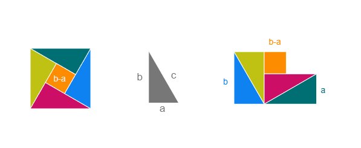

:::::: container
# Section I

> Selected tasks from **Section I** 📚

## What is a proof? 🔎

### Problem 1.1: Visual Proof of Pythagoras

**(a)** First, we arrange the shapes to form a $c \cdot c$ square, proving that the inner square is $(b - a) \cdot (b - a)$

**(b)** Next we rearrange the shapes to form two squares, one $b \cdot b$ and the other $a \cdot a$.

::: {.text-center .my-4}

:::

Since both figures represent the same area —\
**Figure 1**: $c^2$ and **Figure 2**: $a^2 + b^2$ —\
this provides a visual proof of the Pythagorean theorem:

$$
c^2 = a^2 + b^2
$$

::: callout-note
Since we simply rearranged the exact same shapes, the total area remains the same in both figures.
:::

**(c)** The construction doesn’t rely on $a = b$. It only assumes the triangles are **congruent** and **right-angled**.

------------------------------------------------------------------------

### Problem 1.2

$$
1 = \sqrt{1}  
= \sqrt{(-1)(-1)}  
= \sqrt{-1} \cdot \sqrt{-1}  
= \left( \sqrt{-1} \right)^2  
= -1
$$

**(a)** Illegal use of square roots on negative numbers.

$$
\textcolor{red}{\sqrt{-1} \cdot \sqrt{-1}} \quad \textcolor{red}{🚨 illegal!}
$$

**(b)** Prove: if $1 = -1$ → then $2 = 1$

**Add 3 to both sides:**\
$$
1 + 3 = -1 + 3 \Rightarrow 4 = 2
$$

**Divide by 2:**\
$$
\frac{4}{2} = \frac{2}{2} \Rightarrow 2 = 1 \quad \boxed{\textcolor{green}{\checkmark}}
$$

------------------------------------------------------------------------

### Problem 1.3

**(a)** $1/8 > 1/4$

**(See PDF for actual proof)**

$\log_{10}\left(\frac{1}{2}\right) > 0 \Rightarrow$ Multiplying by negatives means you got to flip the inequalty sign, which wasn't done in this 'proof'.

**BOGUS 🚨**

**(b)** Proof below compares $¢$ to $¢^2$. These are two different units.

$$
1¢ = \$0.01 = \textcolor{orange}{(\$0.1)^2 = (10¢)^2} = 100¢ = \$1
$$

The orange term is sus, but probaly legal. Thing is: \$$^2$ and $¢^2$ isn't really a unit im familair with... but what the heck, lets go with it.

**BUT** the red part is where I know the police sirens are blastin'.

$$
... = \textcolor{red}{(10¢)^2 = 100¢} = \$1 
$$

This is where the comparison of our real-life, high-value $¢$ to the suspicious $¢^2$ happens → **BOGUS**.

**(c)** Division by zero → **BOGUS**.

$$
\begin{align*}
a &= b \\
a^2 &= ab \\
a^2 - b^2 &= ab - b^2 \\
(a - b)(a + b) &= (a - b)b 
\quad \text{\color{red}(dividing by $(a-b)=0$)} \\
a + b &= b \\
a &= 0
\end{align*}
$$

------------------------------------------------------------------------

### Problem 1.6

> A rational number is any real number that can be expressed as a simple fraction $\frac{a}{b}$ where both numerator and denominator are integers and $b \neq 0$.

$$
\text{A rational number } r \text{ means } r = \frac{a}{b}, \quad a,b \in \mathbb{Z}, \quad b \neq 0
$$

**Claim:** For any integer $n > 0$, $\log_{7} n$ is either an **integer** or an irrational.

$$
\begin{align*}
\log_{7} n &= \frac{a}{b}, \quad a,b \in \mathbb{Z}, \quad b \neq 0 \quad\text{gcd(a,b)=1}\\
n &= 7^{\frac{a}{b}} \\
n^b &= 7^a \quad ^*
\end{align*}  
$$

> Reminder of the goal: we want to prove that if $\log_{7} n$ is a rational number, it is an integer, meaning that n **HAS** to be a pure power of 7.

\* The **Fundamental Theorem of Arithmetic** says that every number larger than 1 is can be expressed as a product of primes **in exactly one way**. Since RHS $7^a$ can only be expressed as a product of 7(s) and LHS = RHS → LHS is a number expressed by the exact same primes as RHS → $n$ must also be on the form $n = 7^k$ for some integer $k \ge 0$.

> The Fundamental Theorem of Arithmetic states that every integer greater than 1 can be expressed as a product of prime numbers in exactly one way, up to the order of the prime factors.

Knowing that $n = 7^k$ for some integer $k \ge 0$, lets use this in the next part of the proof.

$$
(7^k)^b = 7^{kb} = 7^a
$$

LHS and RHS can only be equal if their exponents match.

$$
kb = a
$$

This reads as *When you multiply* $k$ and $b$ you get $a$ → $a$ is a *multiple* of $b$ or other words, $b$ is a *factor* of $a$, the mathematical notation for this is $b \mid a$ which reads $b$ divides $a$.

> -   $k$ is an integer because $n = 7^k$ and $n$ is a natural number (by the Fundamental Theorem of Arithmetic, the exponent in a prime power decomposition is an integer).
> -   $b$ is an integer by our initial assumption $\log_7 n = a/b$ with $a,b \in \mathbb{Z}$, $b>0$.
> -   Therefore, $k b$ is an integer, and since $k b = a$, this means $b$ is a divisor of $a$.

In the start of our proof we defined $\frac{a}{b}$ being in the lowest terms, AKA their **greatest common divisor is 1** ❗❗

We also defined $b \ge 0$ and proved that $kb = a \Rightarrow b \mid a$, meaning that $b = 1$ because we defined in the start that $b$ and $a$ had **no factors in common with eachother except** $1$ → $b = 1$.

$$
\begin{align*}
\log_{7} n &= \frac{a}{1} \\
\log_{7} n &= a \\
n &= 7^a \\
\end{align*}  
$$

**PROVED** ✅

------------------------------------------------------------------------

### Problem 1.9

Prove that if $a \cdot b = n$, then either $a$ or $b$ must be $\le \sqrt{n}$.

We prove this one by using contradiction. Since we are not specifying use of integers, my initial thought of using $\sqrt{n} + 1$ is insufficient... 😅

Rather, we set $a, b \ge \sqrt{n}$.

So we got:

$$
\begin{align*}
a, b &\gt \sqrt{n} \\
ab &\gt \sqrt{n} \cdot \sqrt{n} \quad \quad \textcolor{orange}{\text{(contradicts $a \cdot b = n$)}}
\end{align*}
$$

**Proof by contradiction**, if both $a$ and $b$ are greater than $\sqrt{n}$, their product will be greater than $n$.

------------------------------------------------------------------------

### Problem 1.10

**(a)** **Explain** why if $n^2$ is even --- then $n$ is even.

Every integer can be expressed as a product of prime factors. For the number $n$, let's make a set of its prime factors (allowing repeats). If $n$ is even, $2 \in \{\text{prime factors of } n\}$.

$$
\text{Let } n = \{ 2, p_2, p_3 \} \quad\text{(prime factors of $n$)}
$$

When we square $n$, its prime factors just get duplicated.

$$
n^2 = \{ 2, p_2, p_3, 2, p_2, p_3 \}
$$

So for any $n^2$ that has $2$ as a prime factor, it must have already been a prime factor of $n$. 🔢

**→ They are both even!**

**(b)** **Same logic as above, but with 3 instead of 2.**

------------------------------------------------------------------------

## Well Ordering Principle 🔢

### Problem 2.14

We want to prove that $\mathbb{N} + \mathbb{F}$ is well-ordered, where:

$$
\mathbb{F} = \left\{ \frac{n}{n+1} \mid n \in \mathbb{N}_0 \right\}
$$

Every element is of the form $n + f$ with $f < 1$, so everything in the $n$-block lives between $n$ and $n + 1$.

Let $S \subseteq \mathbb{N} + \mathbb{F}$ be a nonempty set. We'll show it has a least element.

------------------------------------------------------------------------

**Step 1: Pick the smallest integer block**

Let $$
A = \{ n \in \mathbb{N}_0 \mid \exists f \in \mathbb{F},\ n + f \in S \}
$$

Here we collect all the whole numbers $n$ such that at least one fraction $f$ exists where $n + f$ is in our set $S$ in a seperate subset $A$.

Since $\mathbb{N}_0$ is well-ordered, $A$ has a smallest element — call it $n_s$.

------------------------------------------------------------------------

**Step 2: Pick the smallest** $f$ that appears with $n_s$

Define\
$$
B = \{ f \in \mathbb{F} \mid n_s + f \in S \}
$$

$B \subseteq S$, containing all fractions that exist in combination with $n_s$ in $S$. Since $\mathbb{F}$ is well-ordered, $B$ has a least element — call it $f_s$.

Let $x_0 = n_s + f_s$.

------------------------------------------------------------------------

**Step 3: Prove** $x_0$ is the smallest

Take any $x = m + g \in S$. Then:

-   If $m < n_s$:\
    Then $x < n_s \le x_0$ — contradiction, since $n_s$ was minimal.

-   If $m = n_s$:\
    Then $x = n_s + g$. But $f_s$ is the smallest $f$ such that $n_s + f \in S$,\
    so $g \ge f_s \Rightarrow x \ge x_0$

-   If $m > n_s$:\
    Then $x > n_s + 1 > x_0$

✅ So $x \ge x_0$ in all cases ⇒ $x_0$ is the minimum of $S$

------------------------------------------------------------------------

## Mathematical Data Types ➰

### Problem 4.25

**(b)** Assume $h = f \circ g$ is injective and $f$ is total. To prove that $g$ must be injective, we use **contradiction**.

Suppose $g$ is **not injective**, so:

$$
\exists a_1, a_2 \in A \quad \text{such that} \quad a_1 \ne a_2 \quad \text{and} \quad g(a_1) = g(a_2) = b_0
$$

Since $f$ is a function, and it is total, that means $f(b_0)$ exists. Let’s call it $c_0$:

$$
f(b_0) = c_0
$$

Then:

$$
h(a_1) = f(g(a_1)) = f(b_0) = c_0
$$

$$
h(a_2) = f(g(a_2)) = f(b_0) = c_0
$$

So we get:

$$
h(a_1) = h(a_2) = c_0
$$

But we assumed $a_1 \ne a_2$ → contradiction, because $h$ was supposed to be injective.

::: callout-important
**Conclusion:** If $h$ is injective and $f$ is total, then $g$ must also be injective ✅
:::

## Induction 👩‍⚖️

### Problem 5.5

We are proving this statement by induction.

Our predicate $P(n)$ will be:

$$
\forall n > 1, \quad \sum_{i=1}^{n} \frac{1}{i^2} < 2 - \frac{1}{n}
$$

#### Base case

Base case for this induction is $P(2)$.

$$
S_2 = \sum_{i=1}^{2} \frac{1}{i^2}
= 1 + \frac{1}{4}
= \frac{5}{4}
= 1.25
$$

On the other hand,

$$
2 - \frac{1}{2} = \frac{3}{2} = 1.5
$$

Which means

$$
S_2 = 1.25 < 1.5 = 2 - \frac{1}{2} \quad \boxed{\textcolor{green}{\checkmark}}
$$

base case $P(2)$ holds.

#### Induction Step

Assuming $P(n)$ is true, we know:

$$
S_n = \sum^{n}_{i=1} \frac{1}{i^2} < 2 - \frac{1}{n}
$$

Working our way to $P(n+1)$, we want to prove that this equation holds:

$$
S_{n+1} = \sum^{n+1}_{i=1} \frac{1}{i^2} < 2 - \frac{1}{(n + 1)}
$$

Adding $\frac{1}{(n+1)^2}$ to both sides, this also holds true:

$$
S_n + \frac{1}{(n+1)^2} < \left( 2 - \frac{1}{n} \right) + \frac{1}{(n+1)^2}
$$

Knowing (by assumption), that $S_n < 2 - \frac{1}{n}$, lets swap $S_n$ for its inductive bound to form an inequality we can work with.

$$
\left( 2 - \frac{1}{n} \right) + \frac{1}{(n+1)^2} < 2 - \frac{1}{n + 1}
$$

If we manage to prove the above equation, we have proven $P(n)$ by induction. Lets simplify! 🚀

**Cancel the 2's:**\
$$
- \frac{1}{n} + \frac{1}{(n+1)^2} < - \frac{1}{n + 1}
$$

**Flip signs:**\
$$
\frac{1}{n} - \frac{1}{(n+1)^2} > \frac{1}{n + 1}
$$

**Simplify LHS:**\
$$
\frac{1}{n} - \frac{1}{(n+1)^2} = \frac{(n+1)^2 - n}{n(n+1)^2} = \frac{n^2+n+1}{n(n+1)^2}
$$

**Now the inequality is:**\

$$
\frac{n^2+n+1}{n(n+1)^2} > \frac{1}{n + 1}
$$

❗ **NB:** Since n > 1, denominators are always positive, allowing for cross multiplication.

**Cross multiply:**\
$$
\left( \frac{n^2+n+1}{n(n+1)^2} \right) \cdot \left( n(n+1)^3 \right) > \frac{1}{n + 1} \left( n(n+1)^3 \right)
$$

**Cancel out the common items:**\
$$
n^2+n+1 > n(n+1) = n^2 + n
$$

**Move everything to LHS:**\
$$
1 > 0
$$

✅ always true &rarr; $P(n)$ proven by induction.

::::::